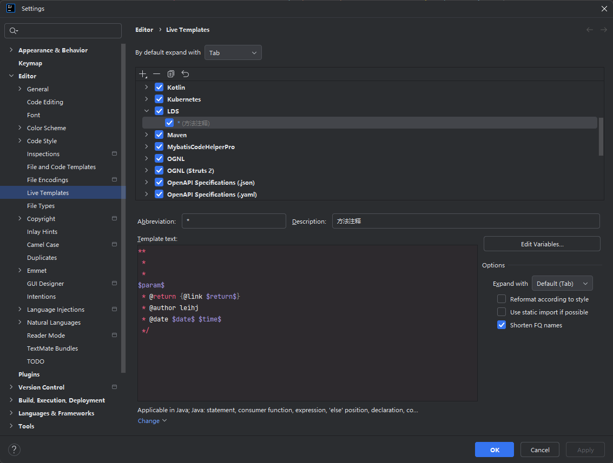
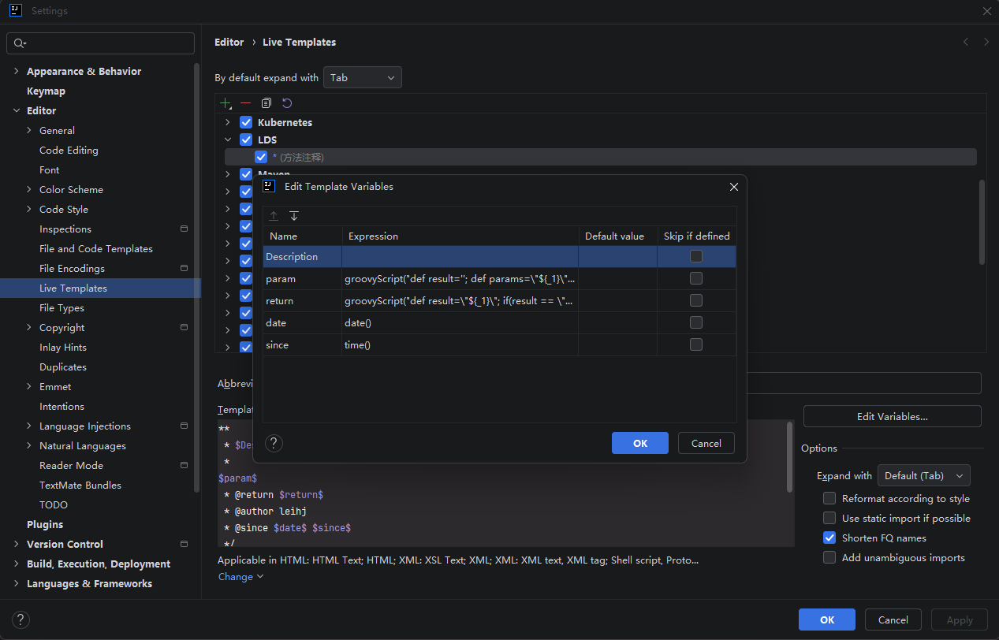

# IDEA 方法注释配置

> 创建方法注释模板: File→Settings→Editor→Live Templates

> 
> 

```
**
 * $Description$
 *
$param$
 * @return $return$
 * @author xxx
 * @date $date$ $time$
 */
```

> 参数模板配置

```
param: groovyScript("def result=''; def params=\"${_1}\".replaceAll('[\\\\[|\\\\]|\\\\s]', '').split(',').toList(); for(i = 0; i < params.size(); i++) {result+=' * @param ' + params[i] + ((i < params.size() - 1) ? '\\r\\n' : '')}; return result", methodParameters())

return: groovyScript("def result=\"${_1}\"; if(result == \"void\"){return \"\";}else{return \"{@link \"+result+\"}\";}", methodReturnType())

date: date()

since: time()

```

> 颜色模板注释

```java
/**
 * <strong style='color:purple;'>Created with IntelliJ IDEA.<hr>
 * <strong style='color:orange;'>Author: <hr>
 * <strong style='color:yellow;'>Date: ${DATE} ${TIME}<hr>
 * <strong style='color:blue;'>Class: ${PACKAGE_NAME}<hr>
 * <strong style='color:green;'>Project: ${PROJECT_NAME}<hr>
 * <strong style='color:red;'>Description: ${Description}<hr>
 */
```
