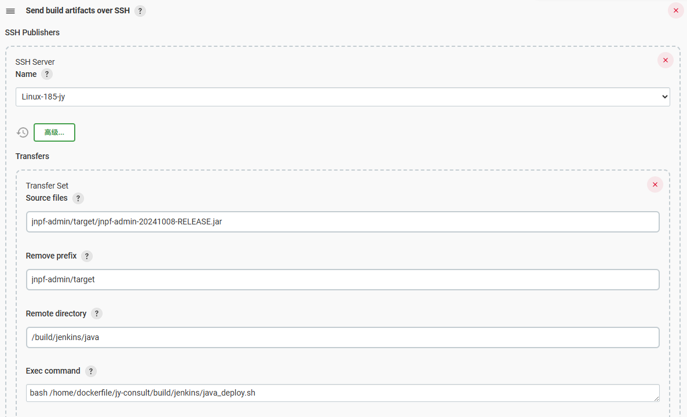
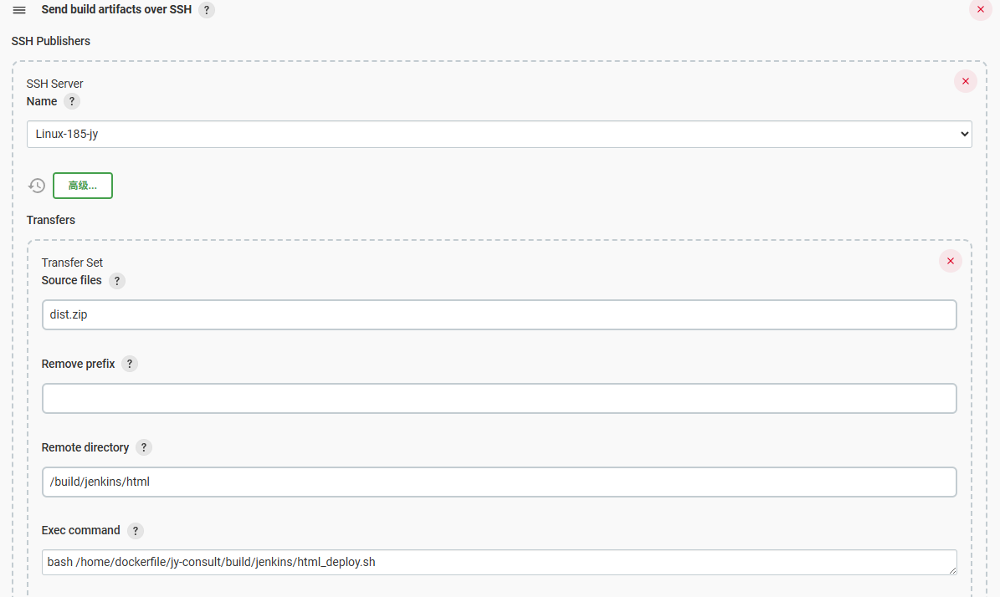

# Jenkins 自动部署

### JAVA 项目 SSH 配置



### JAVA 项目 java\_deploy.sh 执行脚本

```bash
#!/bin/bash
set -euo pipefail  # 更严格的错误检查

# ===== 配置部分 =====
MAIN_DIR="/home/dockerfile/cost-consult-ly"  # 主目录设置
SOURCE_DIR="${MAIN_DIR}/build/jenkins/java"
TARGET_DIR="${MAIN_DIR}/business/docker-resource/jar"
SPECIFIC_FILE="jnpf-admin-20241008-RELEASE.jar"
LOG_DIR="${MAIN_DIR}/build/jenkins"
DOCKER_COMPOSE_DIR="${MAIN_DIR}"  # 使用主目录作为docker-compose目录
SERVICE_NAME="business"
# ====================

# 日志设置
current_time=$(date +"%Y-%m-%d %H:%M:%S")
log_file_time=$(date +"%Y%m%d")
log_file="${LOG_DIR}/${log_file_time}_deploy_java.log"
# ====================

# 初始化日志系统
init_logging() {
    mkdir -p "$LOG_DIR"
    exec > >(tee -a "$log_file") 2>&1
    echo "======= 部署启动于 $current_time ======="
    echo "执行用户: $USER"
    echo "工作目录: $(pwd)"
    echo "主目录: $MAIN_DIR"
    echo "环境变量:"
    printenv | grep -v 'PASSWORD\\|SECRET\\|TOKEN' || true
}

# 检查目录存在性
check_directories() {
    local dirs=("$SOURCE_DIR" "$TARGET_DIR" "$DOCKER_COMPOSE_DIR" "$MAIN_DIR")
    for dir in "${dirs[@]}"; do
        if [ ! -d "$dir" ]; then
            echo "❌ 错误：目录不存在 $dir"
            exit 10
        fi
    done
}

# 文件操作函数
handle_file_operations() {
    echo "🔍 扫描源目录: $SOURCE_DIR"
    ls -la "$SOURCE_DIR"

    # 清理目标文件
    if compgen -G "$TARGET_DIR/$SPECIFIC_FILE" > /dev/null; then
        echo "🗑️ 清理旧文件: $TARGET_DIR/$SPECIFIC_FILE"
        rm -v "$TARGET_DIR/$SPECIFIC_FILE"
    fi

    # 查找并复制最新jar文件
    local jar_files=("$SOURCE_DIR"/jnpf-admin-*.jar)
    if [ ${#jar_files[@]} -eq 0 ]; then
        echo "❌ 错误：未找到匹配的JAR文件"
        exit 20
    fi

    local latest_jar
    latest_jar=$(ls -t "$SOURCE_DIR"/jnpf-admin-*.jar | head -1)
    echo "📦 找到最新JAR文件: $latest_jar"

    echo "🚚 复制文件到目标目录..."
    cp -v "$latest_jar" "$TARGET_DIR/" || {
        echo "❌ 文件复制失败"
        exit 30
    }

    echo "🧹 清理源目录..."
    rm -vf "$SOURCE_DIR"/*
}

# 容器管理函数
manage_container() {
    echo "🐳 检查Docker环境..."
    if ! command -v docker-compose &> /dev/null; then
        echo "⚠️ 警告：docker-compose 未安装，跳过容器重启"
        return
    fi

    local compose_file="${DOCKER_COMPOSE_DIR}/docker-compose.yml"
    if [ ! -f "$compose_file" ]; then
        echo "⚠️ 警告：docker-compose.yml 不存在，跳过容器重启"
        return
    fi

    echo "🔄 准备重启服务: $SERVICE_NAME"
    if (cd "$DOCKER_COMPOSE_DIR" && docker-compose ps | grep -q "$SERVICE_NAME"); then
        echo "⏳ 正在重启服务..."
        if (cd "$DOCKER_COMPOSE_DIR" && docker-compose restart "$SERVICE_NAME"); then
            echo "✅ 服务重启成功"
            echo "📊 服务状态:"
            (cd "$DOCKER_COMPOSE_DIR" && docker-compose ps "$SERVICE_NAME")
        else
            echo "❌ 服务重启失败"
            exit 40
        fi
    else
        echo "⚠️ 服务未运行，尝试启动..."
        (cd "$DOCKER_COMPOSE_DIR" && docker-compose up -d "$SERVICE_NAME") || {
            echo "❌ 服务启动失败"
            exit 50
        }
    fi
}

# 主执行流程
main() {
    init_logging
    check_directories
    handle_file_operations
    manage_container

    local end_time=$(date +"%Y-%m-%d %H:%M:%S")
    local duration=$(( $(date -d "$end_time" +%s) - $(date -d "$current_time" +%s) ))
  
    echo "======= 部署完成于 $end_time ======="
    echo "⏱️ 总耗时: ${duration}秒"
    echo "✅ 状态: 部署成功"
    echo "🪵 日志位置: $log_file"
}

main
```

### HTML 项目 执行Shell 配置

```bash
# 1. 环境检查
whoami
node -v
yarn -v

# 2. 配置 npm 镜像（国内建议使用）
npm config set registry <https://registry.npmmirror.com>
npm config get registry

# 3. 清理旧构建产物
rm -rf dist dist.zip

# 4. 智能安装依赖（仅在 node_modules 不存在或 package.json 变更时安装）
if [ ! -d "node_modules" ] || [ "$(find package.json -newer node_modules)" ]; then
    echo "安装依赖..."
    yarn install
else
    echo "使用缓存依赖"
fi

# 5. 构建项目
yarn run build

# 6. 打包产物
pwd
zip -r dist.zip ./dist
```

### HTML 项目 SSH 配置



### HTML 项目 html\_deploy.sh 执行脚本

```bash
#!/bin/bash
set -euo pipefail  # 更严格的错误检查

# ===== 配置部分 =====
MAIN_DIR="/home/dockerfile/cost-consult-ly"  # 主目录设置
SOURCE_DIR="${MAIN_DIR}/build/jenkins/html"
TARGET_DIR="${MAIN_DIR}/business/docker-resource/html/platform-web"
SPECIFIC_FILE="${SOURCE_DIR}/dist.zip"
LOG_DIR="${MAIN_DIR}/build/jenkins"
# ====================

# 日志设置
current_time=$(date +"%Y-%m-%d %H:%M:%S")
log_file_time=$(date +"%Y%m%d")
log_file="${LOG_DIR}/${log_file_time}_deploy_html.log"
# ====================

# 初始化日志系统
init_logging() {
    mkdir -p "$LOG_DIR"
    exec > >(tee -a "$log_file") 2>&1
    echo "======= 部署启动于 $current_time ======="
    echo "执行用户: $USER"
    echo "工作目录: $(pwd)"
    echo "主目录: $MAIN_DIR"
    echo "环境变量:"
    printenv | grep -v 'PASSWORD\\|SECRET\\|TOKEN' || true
}

# 检查目录存在性
check_directories() {
    local dirs=("$SOURCE_DIR" "$TARGET_DIR" "$MAIN_DIR")
    for dir in "${dirs[@]}"; do
        if [ ! -d "$dir" ]; then
            echo "❌ 错误：目录不存在 $dir"
            exit 10
        fi
    done
}

# 文件操作函数
handle_file_operations() {
    echo "🔍 扫描源目录: $SOURCE_DIR"
    ls -la "$SOURCE_DIR"

    # 清理目标目录
    echo "🗑️ 清理目标目录: $TARGET_DIR"
    rm -rfv "$TARGET_DIR"/*

    # 检查压缩文件是否存在
    if [ ! -f "$SPECIFIC_FILE" ]; then
        echo "❌ 错误：压缩文件 $SPECIFIC_FILE 不存在"
        exit 20
    fi

    # 解压文件
    echo "📦 解压文件: $SPECIFIC_FILE"
    unzip -q "$SPECIFIC_FILE" -d "$SOURCE_DIR" || {
        echo "❌ 解压失败"
        exit 30
    }

    # 复制文件
    echo "🚚 复制文件到目标目录..."
    cp -rv "$SOURCE_DIR"/dist/* "$TARGET_DIR/" || {
        echo "❌ 文件复制失败"
        exit 40
    }

    # 清理操作
    echo "🧹 执行清理操作..."
    rm -rfv "$SOURCE_DIR"/dist* "$SOURCE_DIR"/*
}

# 主执行流程
main() {
    init_logging
    check_directories
    handle_file_operations

    local end_time=$(date +"%Y-%m-%d %H:%M:%S")
    local duration=$(( $(date -d "$end_time" +%s) - $(date -d "$current_time" +%s) ))
  
    echo "======= 部署完成于 $end_time ======="
    echo "⏱️ 总耗时: ${duration}秒"
    echo "✅ 状态: 部署成功"
    echo "🪵 日志位置: $log_file"
}

main
```
