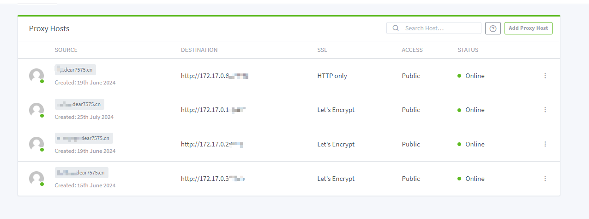
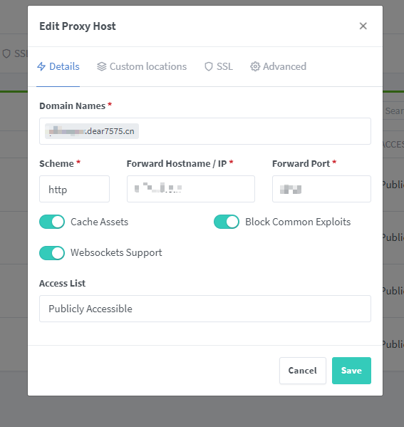
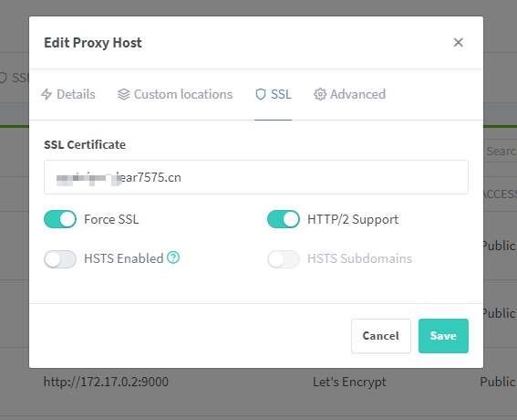

# Nginx Proxy Manager 相关配置

> docker-compose.yml 文件配置 

```yaml
services:
  nginx-web:
    image:
        jc21/nginx-proxy-manager:latest
    container_name:
        nginx-web
    restart:
        always
    network_mode:
        bridge
    ports:
        - 80:80
        - 81:81
        - 443:443
    volumes:
        - ./data:/data
        - ./letsencrypt:/etc/letsencrypt
```

> 如果需要设置Nginx Proxy [Manager使用域名访问则需要在阿里云解析中增加xxxx.dear7575.cn](http://xn--Managerxxxx-618qt4bg9fpzn17bg7j57pjjdk3et12ijr2cf27ej6b47s1t3bclx55b35i.dear7575.cn)，且将下图配置IP改成Docker主IP，如:172.17.0.1

---

> 


> 


> 
